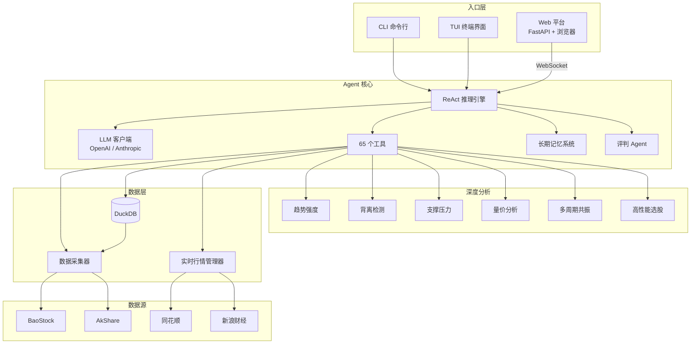

# DeepPulse

> A 股短线交易 AI 分析师 — 用自然语言对话完成技术分析、行情监控和策略回测。

**演示视频** — [DeepPulse：一个专注于短线交易的 Agent](https://www.bilibili.com/video/BV1kbVQ6HELU)

## 功能一览

| 能力 | 说明 |
|------|------|
| **🌐 Web 平台** | **浏览器可视化界面，AI 对话 + 实时行情 + 分析工具 + 战法库** |
| **🖥️ TUI 全屏界面** | **暗色金融主题，三栏布局，命令系统和快捷键** |
| **⌨️ CLI 命令行** | **快速单次分析或交互式对话** |
| 自然语言交互 | 中文提问，Agent 自动调度 65 个工具完成分析 |
| **⚖️ 评判Agent** | **自适应评测：根据问题类型评分 1-10，快速给出改进建议** |
| 技术指标 | MA / MACD / RSI / KDJ / 布林带 / ATR / OBV / ADX / CCI / MFI / VWAP |
| K 线形态 | 十字星、锤子线、吞没、早晨之星等经典形态自动识别 |
| **深度分析** | **趋势强度评估、背离检测、支撑压力位、量价分析、多周期共振** |
| 市场情绪 | 涨停/跌停/炸板统计、连板高度、情绪五档评级 |
| 板块与资金 | 行业板块排行（同花顺+东方财富）、资金流向、龙虎榜 |
| **条件选股** | **DuckDB 高性能选股，支持组合条件** |
| 财经新闻 | 百度/东方财富/新浪多源聚合 |
| 实时行情 | 新浪 + 东方财富双源冗余，三态熔断器自动故障切换 |
| **策略回测** | **7 种策略、参数优化、Monte Carlo 模拟** |
| K 线图 | 专业 K 线图，Web 端交互式，CLI/TUI 自动生成 |
| 短线战法库 | 40 个内置战法，**Web 端可视化编辑** |
| 自选股 & 告警 | 分组管理、目标价止损价、价格/放量/RSI 告警 |
| 交易日志 | 记录买卖、自动更新持仓、生成周/月复盘报告 |
| 长期记忆 | 跨会话记住分析结论、用户偏好、教学纠错 |
| 预测跟踪 | 保存预测并自动验证结果，从对错中持续学习 |

## 系统架构



## 核心技术

### ReAct 推理引擎

DeepPulse 基于 ReAct（Reasoning + Acting）范式构建。LLM 在每一轮对话中自主完成「思考 → 选择工具 → 执行 → 观察结果 → 继续推理」的循环，直到得出分析结论。整个过程对用户透明——你可以看到 Agent 为什么调用某个工具、得到了什么数据、如何一步步推导出结论。

```
用户: 贵州茅台短线怎么样

→ 思考: 需要先更新数据，再看技术面和资金面
→ 调用: update_stock("600519")        → K线已更新至最新
→ 调用: realtime_price("600519")      → 当前价 1856.00
→ 调用: calc_technical("600519")      → RSI=32 超卖区, MACD金叉
→ 调用: recognize_kline_patterns(...)  → 锤子线(看涨)
→ 调用: stock_fund_flow("600519")     → 近3日主力净流入
→ 调用: search_strategy("超卖反弹")   → 匹配: 超跌低吸战法
→ 输出: 综合分析结论 + 操作建议
```

内置 **65 个工具**，覆盖数据采集、技术分析、深度分析、市场情绪、新闻搜索、选股筛选、回测验证、记忆管理等全链路，Agent 根据问题自动编排调用顺序。

### 动态推理链

DeepPulse 不是用固定模板回答问题。它会先判断当前市场状态（高潮期/发酵期/启动期/低迷期/冰点期），然后动态调整分析策略：

| 市场状态 | 风险等级 | 分析重点 | 推荐战法 |
|----------|----------|----------|----------|
| 高潮期 | 高 | 高位风险、获利了结、仓位控制 | 空仓战法、龙头首阴、分歧转一致 |
| 发酵期 | 中 | 龙头确认、板块持续性、跟风筛选 | 龙头战法、二板接力、板块首板 |
| 启动期 | 中低 | 新题材识别、首板打板、低位布局 | 低位首板、题材首板、5日线低吸 |
| 低迷期 | 低 | 超跌反弹、情绪冰点、左侧布局 | 超跌低吸、反核战法、翘板 |
| 冰点期 | 极低 | 极端超跌、情绪修复、等待转机 | 空仓观望、超跌低吸 |

每种状态下，Agent 的分析权重、风险提示风格、推荐策略都会自动调整。

### 评判Agent - 全流程质量评测

DeepPulse 的**评判Agent**（Judge Agent）对主分析Agent的**完整输出流程**进行全面质量评测：

**评测维度**：
1. **数据核实**（最重要） — 逐一核对主Agent引用的数据与工具实际返回的数据是否一致，检查是否编造数据
2. **推理链完整性** — 是否充分利用了获取到的所有数据？多轮推理中观点是否自洽？
3. **工具使用合理性** — 是否调用了足够覆盖问题所需的工具？是否遗漏关键工具？
4. **风险覆盖** — 是否提及主要风险因素？是否存在过度绝对化的表述？
5. **操作建议合理性** — 买卖建议是否有明确的数据支撑？是否给出仓位/止损等风控建议？

**输出示例**：
```
⚖️ 评判Agent:

📊 评测报告

━━━ 综合评分: 7.5/10 ━━━

✅ 做得好的：
- 正确识别了RSI超卖信号，指标计算准确
- 调用了calc_technical和query_kline，数据覆盖较全面

⚠️ 需要注意的 3 个问题：

1. ⚠️ **风险遗漏** 虽然RSI超卖，但未检查成交量是否配合
   💡 建议：补充查询近5日成交量变化，确认是否有放量信号

2. ❓ **逻辑疑问** MACD金叉在哪个周期？日线金叉和60分钟金叉意义不同
   💡 建议：明确具体周期，或补充多周期共振分析

3. 💭 **信息缺失** 未提及茅台所处板块（白酒）近期走势
   💡 建议：可调用 sector_ranking 查看板块整体情况

📊 数据核实：
- 本轮共调用 5 个工具，获取了 5 条关键数据
- 主Agent引用了 3 条数据，其中：✅ 3条准确 / ⚠️ 0条存疑 / ❌ 0条错误

🎯 改进建议：
- 补充成交量和板块数据，分析会更完整

👤 你认为这个分析：
[✅ 认可] [❌ 不认可]
```

**纠错学习闭环**：
- 用户选择"不认可" → 描述具体问题 → 自动记录到`learning`记忆（半衰期180天）
- 下次遇到类似场景时，Agent会参考这次纠正经验，避免重复错误

### 长期记忆系统

DeepPulse 拥有跨会话的长期记忆能力，包含 6 个子模块协同工作：

**语义搜索** — 三级回退机制：
1. **向量语义搜索**（sentence-transformers，768 维本地模型）— 理解语义相似性，即使措辞不同也能找到相关记忆
2. **BM25 关键词搜索** — 无 embedding 时的回退方案，比 LIKE 匹配准确率提升 50%+
3. **关键词回退** — 兜底方案

**智能上下文注入** — 每次对话开始时，系统按预算比例自动组装上下文注入 LLM：

```
┌─────────────────────────────────────────────────┐
│           上下文预算分配 (默认 4000 字)            │
├──────────────┬──────────────────────────────────┤
│ 30% 相关记忆 │ 与当前问题最相关的历史记忆          │
│ 25% 学习记忆 │ 用户教学/纠错（最宝贵的知识）       │
│ 20% 用户画像 │ 交易风格、风险偏好、止损习惯        │
│ 15% 会话摘要 │ 最近几次对话的摘要                  │
│ 10% 预测结果 │ 高置信度的历史预测验证              │
└──────────────┴──────────────────────────────────┘
```

**记忆衰减与整合** — 低重要度且长期未访问的记忆按指数半衰期自动遗忘；会话结束时 LLM 语义合并相似记忆，避免信息冗余。

**预测跟踪** — Agent 给出分析结论时自动保存预测，下次分析同只股票时自动验证。正确的预测提升关联记忆权重，错误的预测生成教训记忆。

**用户画像** — 从对话中自动提取交易风格（低吸/追高/打板）、风险偏好（稳健/激进）、止损习惯、关注板块，个性化调整分析建议。

**知识图谱** — 结构化存储指标、策略、规则之间的关系（触发、支持、矛盾），分析时自动查询关联实体辅助推理。

### 数据源韧性保护

DeepPulse 对数据源的稳定性做了全面加固：

**历史数据源（BaoStock / AkShare）：**
- **健康检查式连接管理** — BaoStock 每次调用前探活，session 断开自动重连，不再出现"僵死连接"问题
- **统一指数退避重试** — 所有数据源共享 `RetryPolicy`，指数退避 + 随机抖动防止惊群效应
- **周期性重连** — 全量采集每 150 只股票主动重连一次，防止长时间运行后的连接老化
- **连续失败检测** — 连续 3 次失败触发立即重连；超时和 socket 错误触发即时重连
- **数据验证层** — 入库前自动检查 NaN 价格、high < low 等异常、负成交量，拦截脏数据

**实时行情（新浪 / 东方财富）：**
- **三态熔断器** — closed → open → half_open 状态机，恢复时先少量试探再全量放行，避免刚恢复就压垮服务
- **连接复用** — 新浪源复用 curl_cffi Session，省去每次请求的 TLS 握手开销
- **缓存竞态修复** — 东方财富的全市场快照缓存修复了双重检查锁中的时间戳竞态问题

**数据库层：**
- **事务保护** — `upsert_stock_info` 的 DELETE + INSERT 在同一事务中，崩溃不会丢数据
- **连接上下文管理器** — `get_db_connection()` 确保连接正确关闭
- **索引优化** — 新增 `fetch_log(code, data_source)` 和 `daily_kline(trade_date)` 索引

所有韧性参数（重试次数、退避因子、熔断阈值、重连间隔等）集中在 `config.py` 中配置。

### 战法库

内置 **40 个完整短线战法**（Markdown 格式），涵盖首板、接力、低吸、半路、龙头、盘口等 8 大分类。Agent 根据当前技术面自动搜索匹配战法，将战法逻辑融入分析结论。支持用户自定义添加。

## 快速开始

### 环境要求

- Python 3.10+
- 操作系统：Windows / macOS / Linux

### 第一步：安装依赖

```bash
pip install -r requirements.txt
```

### 第二步：配置 LLM

复制配置模板并填入你的 API Key：

```bash
cp setting.example.json setting.json
```

编辑 `setting.json`，填入你的 API Key。

支持 OpenAI 和 Anthropic 两种主流 API 调用协议。

### 第三步：启动

```bash
# 方式一：Web 平台（推荐）
python -m webapp

# 方式二：CLI 命令行
python -m cli "分析一下贵州茅台"

# 方式三：TUI 终端界面
python -m tui
```

Web 平台启动后访问 http://localhost:8000

| LLM | protocol | base_url |
|-----|----------|----------|
| OpenAI协议 | `openai` | `https://api.openai.com/v1` |
| Anthropic协议 | `anthropic` | `https://api.anthropic.com` |

预设置模型默认DeepSeek，完全可以自行修改。

API Key 支持环境变量：`"${ENV_VAR_NAME}"`

### 第三步：初始化数据库

```bash
# 一键全量采集（约 3500 只股票 x 5 年日K，使用 BaoStock 数据源）
python scripts/fetch_all.py
```

> **为什么这么慢？**
>
> 首次采集需要从 BaoStock 下载约 3500 只沪深主板股票的 5 年日 K 线数据，数据量约 400 万条记录。BaoStock 为免费公开接口，有隐式频率限制，因此全程约需 30-60 分钟。这是一次性操作，后续只需增量更新（几秒钟）。
>
> `fetch_all.py` 调用统一的 `DataCollector`，内置断点续传、周期性重连、指数退避重试、socket 错误自动恢复、数据验证等韧性机制，可放心中断后重新运行。所有韧性参数可在 `config.py` 中调整。

也可以使用通用采集脚本（支持指定数据源）：

```bash
python scripts/init_db.py          # 1. 初始化数据库表结构
python scripts/fetch_stocks.py     # 2. 采集股票列表（约 1 分钟）
python scripts/fetch_kline.py --source baostock  # 3. 采集日 K 数据（约 30-60 分钟）
```

也可以指定股票范围或日期：

```bash
# 只采集特定股票
python scripts/fetch_kline.py --source baostock --codes 600519 000001

# 指定日期范围
python scripts/fetch_kline.py --source baostock --start 2024-01-01 --end 2026-06-04
```

> 在初始数据更新完成后，通过与 Agent 交互式对话来更新数据也可以。在交易时间 DeepPulse Agent 会自动获取实时数据（免费数据源可能会有延时）。

采集示例，如果数据较多可能会等待较长时间。


### 第四步：启动 DeepPulse

DeepPulse 提供三种界面模式：

#### 🌐 Web 平台（推荐）— 浏览器可视化界面

```bash
python -m webapp
```

启动后访问 http://localhost:8000

**Web 平台特点**：
- 🤖 **AI 对话** — 流式输出，推理过程展示，工具调用可视化
- 📊 **行情中心** — 实时行情、K 线图、技术指标、板块动态
- 🔬 **深度分析** — 趋势强度、背离检测、支撑压力、量价分析、多周期共振
- 🔍 **条件选股** — DuckDB 高性能选股，支持组合条件
- 📰 **新闻资讯** — 多源聚合，涨停快讯，板块动态
- 📚 **战法库** — 40 个内置战法，可视化编辑
- ⚖️ **智能评测** — 自适应评分，根据问题类型给出改进建议

#### 🎨 TUI 模式 — 全屏终端界面

```bash
python -m tui
```

**TUI 模式特点**：
- 🎨 **暗色金融主题** — 涨红跌绿专业配色
- 📐 **三栏布局** — 自选股/持仓 + 对话流 + 工具/数据
- ⚖️ **全流程评测** — 评判Agent 综合评分
- 🎯 **命令系统** — `/help` `/memory` `/strategy` `/watchlist` `/portfolio` `/judge`

#### 📟 CLI 模式 — 传统命令行

```bash
# 交互模式
python -m cli

# 单次提问
python -m cli "分析一下贵州茅台的短线走势"
```

> **为什么启动需要约 2 分钟？**
>
> DeepPulse 启动时会加载 sentence-transformers 语义模型到内存（768 维向量模型，约 100MB），用于长期记忆的语义搜索。这是纯本地计算，不产生任何 API 费用。加载完成后，后续所有对话的响应速度都在秒级。
>
> 如果不需要语义搜索功能，可以在 `setting.json` 中将 embedding 设为 `"provider": "none"`，启动时间将缩短到 5 秒以内（退化为 BM25 关键词搜索）。

## 日常使用

### 启动后数据更新

启动后不需要手动更新数据，DeepPulse 会按需自动处理：

- **分析单只股票** → 自动更新该股票的最新 K 线（几秒）
- **说"更新数据库"** → 全量增量更新（约 10-15 分钟）

手动增量更新：

```bash
python scripts/update_data.py              # 更新最近 5 天
python scripts/update_data.py --max-days 10  # 回溯 10 天
```

### 交互命令

| 命令 | 说明 |
|------|------|
| `quit` / `exit` / `q` | 退出 |
| `reset` | 重置对话（自动保存会话摘要） |
| `/help` | 显示帮助 |
| `/memory` | 查看所有长期记忆 |
| `/memory search <关键词>` | 搜索记忆 |
| `/memory predictions` | 预测准确率统计 |
| `/memory profile` | 用户交易画像 |
| `/memory knowledge` | 知识图谱 |
| `/strategy` | 列出所有短线战法 |
| `/strategy search <关键词>` | 搜索匹配战法 |
| `/watchlist` | 查看自选股 |
| `/watchlist add <代码>` | 添加自选股 |
| `/portfolio` | 查看持仓和盈亏 |
| `/portfolio history` | 交易记录 |
| `/portfolio review` | 生成复盘报告 |
| `/judge` | 手动触发评判Agent |
| `/stats` | 显示会话统计 |
| `/clear` | 清屏 |

**快捷键**（TUI 模式）：

| 快捷键 | 说明 |
|--------|------|
| `Ctrl+Q` | 退出 |
| `Ctrl+R` | 重置对话 |
| `Ctrl+L` | 清屏 |
| `Ctrl+H` | 显示帮助 |
| `Ctrl+J` | 手动触发评判 |
| `Ctrl+↑/↓` | 浏览历史命令 |

### 对话示例

```
你: 贵州茅台短线怎么样
DeepPulse: [自动调用 update_stock → realtime_price → calc_technical → recognize_kline_patterns → ...]

你: 今天市场热点是什么
DeepPulse: [自动调用 market_hot_news → market_overview → market_sentiment → sector_ranking]

你: 帮我找RSI超卖的股票
DeepPulse: [自动调用 screen_stocks("RSI6<20")]

你: 你分析错了，RSI超卖要结合成交量看
DeepPulse: [自动保存为 learning 记忆，后续分析中应用]
```

### CLI 参数

| 参数 | 说明 |
|------|------|
| `question` | 直接提问（不进入交互模式） |
| `--model <model>` | 覆盖模型名称 |
| `--no-verbose` | 隐藏工具调用过程 |
| `--no-thinking` | 隐藏思考过程 |
| `--no-stream` | 禁用流式输出 |

## 更换数据源

DeepPulse 默认使用免费的 BaoStock 作为首选历史数据源（连接稳定、无限流），AkShare 作为备选。数据源优先级可在 `config.py` 的 `DATA_SOURCES` 中调整。如果你有更好的私有数据源，可以自行替换。

### 数据源接口

数据源需实现 `src/sources/base.py` 中的 `BaseDataSource` 接口：

```python
class BaseDataSource(ABC):
    @abstractmethod
    def get_stock_list(self) -> list[dict]:
        """返回股票列表，每项包含 code, name, market, board, list_date"""

    @abstractmethod
    def get_daily_kline(self, code: str, start_date: str, end_date: str) -> list[dict]:
        """返回日K线数据，每项包含 code, trade_date, open, high, low, close, volume, amount, turnover"""
```

### 添加私有数据源

1. 在 `src/sources/` 下创建新文件，如 `tushare_source.py`
2. 继承 `BaseDataSource` 并实现接口
3. 在 `src/collector.py` 中注册新数据源

```python
# src/sources/tushare_source.py
from src.sources.base import BaseDataSource

class TushareSource(BaseDataSource):
    def __init__(self, token: str):
        import tushare as ts
        self.pro = ts.pro_api(token)

    def get_stock_list(self) -> list[dict]:
        df = self.pro.stock_basic(exchange='', list_status='L')
        return df[['ts_code', 'name', 'market']].to_dict('records')

    def get_daily_kline(self, code: str, start_date: str, end_date: str) -> list[dict]:
        df = self.pro.daily(ts_code=code, start_date=start_date, end_date=end_date)
        return df.to_dict('records')
```

### 替换实时行情源

实时行情模块位于 `src/realtime/`，同样支持插件式扩展：

1. 继承 `src/realtime/base.py` 中的 `RealtimeQuoteSource`
2. 在 `src/realtime/manager.py` 的 `priority` 列表中注册

## 工具一览

<details>
<summary>点击展开全部 65 个工具</summary>

### 数据更新
| 工具 | 说明 |
|------|------|
| `update_stock` | 更新单只股票 K 线（分析前自动调用） |
| `update_all_stocks` | 更新全部股票数据 |
| `realtime_price` | 实时行情（新浪 + 东财双源） |
| `realtime_prices` | 批量实时行情 |
| `update_timeframe_data` | 多周期 K 线数据 |

### 数据查询
| 工具 | 说明 |
|------|------|
| `search_stock` | 搜索股票 |
| `query_stock_info` | 股票基本信息 |
| `query_kline` | 日 K 线数据 |
| `query_timeframe_kline` | 多周期 K 线 |
| `multi_timeframe_analysis` | 多周期共振数据 |
| `latest_price` | 最新价格 |
| `market_overview` | 市场概览 |

### 技术分析
| 工具 | 说明 |
|------|------|
| `calc_technical` | 技术指标 + 量价分析 |

### 新闻搜索
| 工具 | 说明 |
|------|------|
| `search_news` | 财经新闻搜索 |
| `stock_news` | 个股新闻 |
| `market_hot_news` | 市场热点新闻 |

### 市场情绪 & 资金
| 工具 | 说明 |
|------|------|
| `market_sentiment` | 情绪综合分析 |
| `limit_up_pool` | 涨停股池 |
| `sector_ranking` | 板块排行 |
| `stock_fund_flow` | 个股资金流向（多数据源） |
| `dragon_tiger_list` | 龙虎榜 |
| `sector_fund_flow` | 板块资金流 |
| `stock_dragon_tiger` | 个股龙虎榜明细 |

### K 线形态 & 选股
| 工具 | 说明 |
|------|------|
| `recognize_kline_patterns` | K 线形态识别 |
| `screen_stocks` | 技术条件选股 |
| `screen_stocks_v2` | 高性能选股（DuckDB 批量） |
| `detect_divergence` | 背离检测（RSI/MACD/KDJ） |
| `detect_support_resistance` | 支撑压力位检测 |
| `assess_trend` | 趋势强度评估（0-100） |
| `analyze_volume_price` | 深度量价分析 |
| `analyze_confluence` | 多周期共振分析 |

### 回测
| 工具 | 说明 |
|------|------|
| `backtest_stock` | 单只股票策略回测 |
| `backtest_multi_stock` | 多只股票批量回测 |

### 可视化
| 工具 | 说明 |
|------|------|
| `generate_chart` | K 线图 |
| `compare_stocks_chart` | 涨幅对比图 |

### 自选股 & 告警
| 工具 | 说明 |
|------|------|
| `add_to_watchlist` | 添加自选股 |
| `remove_from_watchlist` | 移除自选股 |
| `list_watchlist` | 查看自选股 |
| `set_alert_rule` | 设置告警 |
| `check_alerts` | 检查告警 |
| `get_alert_history` | 告警历史 |

### 交易日志
| 工具 | 说明 |
|------|------|
| `record_trade` | 记录交易 |
| `view_portfolio` | 查看持仓 |
| `view_trade_history` | 交易历史 |
| `generate_review` | 复盘报告 |
| `save_review` | 保存复盘笔记 |

### 记忆系统
| 工具 | 说明 |
|------|------|
| `save_memory` | 保存记忆 |
| `search_memory` | 搜索记忆 |
| `update_memory` | 更新记忆 |
| `delete_memory` | 删除记忆 |
| `list_memories` | 列出记忆 |
| `save_session_context` | 保存会话上下文 |
| `record_learning` | 记录学习知识 |
| `save_prediction` | 保存投资预测 |
| `check_predictions` | 检查待验证预测 |
| `verify_prediction` | 验证预测结果 |
| `prediction_stats` | 预测准确率统计 |
| `get_user_profile` | 获取用户画像 |
| `update_user_profile` | 更新用户画像 |
| `query_knowledge` | 查询知识图谱 |
| `add_knowledge` | 添加知识关系 |

### 战法系统
| 工具 | 说明 |
|------|------|
| `search_strategy` | 搜索匹配战法 |
| `list_strategies` | 列出所有战法 |
| `get_strategy` | 战法详情 |

</details>

## 短线战法库

内置 40 个完整短线战法（Markdown 格式），Agent 根据技术面自动匹配：

| 分类 | 战法 |
|------|------|
| 三大基础 | 首板挖掘、接力、低吸 |
| 首板细分 | 低位首板、首板回封、题材首板、日内首板、换手首板、一字首板 |
| 接力细分 | 二板接力、换手二板、加速二板、三板接力、高位接力、高位缩量加速、高位 T 字板 |
| 低吸细分 | 5 日线低吸、10 日线低吸、平台支撑、龙头首阴反包、分歧低吸、翘板、反核、超跌低吸 |
| 半路细分 | 点火半路、板后半路、超跌反弹半路、弱转强半路 |
| 龙头进阶 | 龙头战法、龙头二波、卡位、补涨龙、龙头情绪周期 |
| 盘口时段 | 集合竞价、尾盘套利、分时攻击波、分时背离 |
| 高阶逻辑 | 分歧转一致、换手板、空仓战法 |

在 `agent/strategies/` 下创建 `.md` 文件即可添加自定义战法。

## 记忆类型

| 类型 | 说明 | 半衰期 |
|------|------|--------|
| `learning` | 用户教学/纠错（最宝贵） | 180 天 |
| `preference` | 用户偏好 | 90 天 |
| `fact` | 重要事实 | 60 天 |
| `summary` | 会话摘要 | 45 天 |
| `insight` | 分析结论 | 30 天 |
| `context` | 上下文线索 | 14 天 |

## 项目结构

```
DeepPulse/
├── deeppulse/                 # Python 核心包（三端共享）
│   ├── __init__.py
│   ├── config.py              # 项目配置
│   ├── agent/                 # Agent 核心
│   │   ├── agent.py           # ReAct 循环引擎
│   │   ├── client.py          # LLM 客户端（OpenAI/Anthropic）
│   │   ├── tools/             # 65 个工具定义
│   │   ├── memory/            # 长期记忆系统
│   │   ├── prompts.py         # System Prompt
│   │   ├── judge_agent.py     # 评判Agent（自适应评分）
│   │   ├── indicators.py      # 统一技术指标引擎
│   │   ├── divergence.py      # 背离检测
│   │   ├── support_resistance.py # 支撑压力位
│   │   ├── trend.py           # 趋势强度评估
│   │   ├── volume_analysis.py # 量价分析
│   │   ├── screener_v2.py     # 高性能选股器
│   │   ├── backtest_optimizer.py # 回测参数优化
│   │   ├── timeframe_confluence.py # 多周期共振
│   │   ├── fund_flow.py       # 多数据源资金流向
│   │   ├── strategies/        # 40 个短线战法（Markdown）
│   │   └── ...
│   └── src/                   # 数据层
│       ├── database.py        # DuckDB 表操作
│       ├── query.py           # 数据查询接口
│       ├── collector.py       # 多源采集协调器
│       ├── sources/           # 历史数据源
│       └── realtime/          # 实时行情
│
├── cli/                       # CLI 入口
│   └── __main__.py
│
├── tui/                       # TUI 入口
│   └── __main__.py
│
├── web/                       # Web 后端
│   ├── app/
│   │   ├── main.py            # FastAPI 入口
│   │   ├── api/               # REST API
│   │   ├── ws/                # WebSocket
│   │   └── services/          # 业务逻辑
│   └── static/
│       └── index.html         # 前端页面
│
├── webapp/                    # 一键启动脚本
│   └── __main__.py
│
├── scripts/                   # 数据采集脚本
├── tests/                     # 测试
├── setting.json               # LLM 配置（已 gitignore）
├── setting.example.json       # 配置模板
├── pyproject.toml             # 打包与工具配置
└── requirements.txt           # 依赖
│   ├── test_screener.py       # 选股器测试
│   ├── test_realtime.py       # 实时行情测试
│   ├── test_resilience.py     # 韧性基础设施测试
│   ├── test_client.py         # LLM 客户端测试
│   ├── test_database.py       # 数据库测试
│   ├── test_query.py          # 查询接口测试
│   ├── test_memory_unit.py    # 记忆系统测试
│   └── test_memory_upgrade.py # 记忆集成测试
│
└── db/                        # 数据库（已 gitignore）
    └── astock.duckdb
```

## 技术栈

| 组件 | 技术 |
|------|------|
| LLM | DeepSeek / OpenAI / Claude |
| 数据库 | DuckDB（嵌入式列式引擎） |
| 历史数据 | BaoStock（首选） + AkShare（备选），均为免费 |
| 实时行情 | 新浪财经 + 东方财富（双源冗余） |
| 语义搜索 | sentence-transformers（本地 768 维） + BM25 |
| 新闻爬虫 | curl_cffi + BeautifulSoup |
| 语言 | Python 3.10+ |

## 注意事项

- 数据源为免费公开接口，可能存在 T+1 延迟
- 仅分析沪深主板股票（6 开头沪市、0 开头深市）
- `days` 参数指交易日（剔除周末节假日），非自然日

## License

[Apache License 2.0](LICENSE)

---

## 免责声明

**DeepPulse 是一个技术分析辅助工具，不构成任何投资建议。**

- DeepPulse 提供的所有分析、信号、策略回测结果和技术指标均仅供参考，不应作为买卖股票的唯一依据
- 股市有风险，投资需谨慎。任何投资决策应基于您自己的独立判断和风险评估
- DeepPulse 的分析基于历史数据和技术指标，无法预测未来走势，过往表现不代表未来收益
- 开发者不对因使用 DeepPulse 而产生的任何投资损失承担责任
- DeepPulse 不提供任何形式的投资咨询、资产管理或金融服务
- 使用 DeepPulse 即表示您已阅读、理解并同意本免责声明

### 如果遇到技术问题或者有好的想法欢迎加入社区交流讨论。
    DeepPulse是一个刚刚起步的开源项目，在使用过程中可能会遇到一些问题，希望大家可以多多包涵。
    如果有问题可以提交issues或者在QQ群中反馈，我会尽最大的努力来解决这些问题。
    同时，诚挚邀请一些感兴趣的小伙伴一起来维护这个项目，有想法的进QQ群加群主即可。

#### QQ
扫描二维码或搜索群号


#### Discord
服务器邀请链接 https://discord.gg/sMdHTe5N

